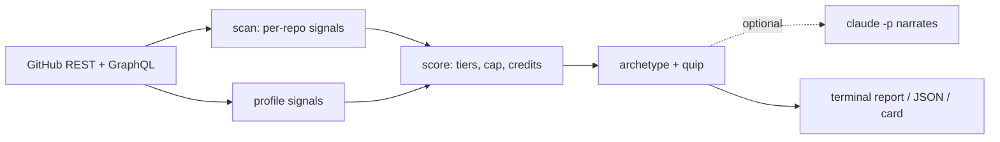

```
 ██████╗ ███████╗███████╗██████╗ ██╗      █████╗ ██████╗ ██████╗
 ██╔══██╗██╔════╝██╔════╝██╔══██╗██║     ██╔══██╗██╔══██╗██╔══██╗
 ██║  ██║█████╗  █████╗  ██████╔╝██║     ███████║██████╔╝██████╔╝
 ██║  ██║██╔══╝  ██╔══╝  ██╔═══╝ ██║     ██╔══██║██╔══██╗██╔═══╝
 ██████╔╝███████╗███████╗██║     ███████╗██║  ██║██║  ██║██║
 ╚═════╝ ╚══════╝╚══════╝╚═╝     ╚══════╝╚═╝  ╚═╝╚═╝  ╚═╝╚═╝
```

<div align="center">

### `WHAT THE README CLAIMS // WHAT THE CODE SHOWS`

*a 0-100 larp score for any GitHub profile or repo, with receipts*

    -5fd38d?style=flat-square&labelColor=111111)


*`npx deeplarp --layout square` on the author's own profile (it would be awkward otherwise)*

</div>

---

## 🔍 What is this

`deeplarp` reads a GitHub profile or repo and checks what it says about itself against what is actually in it. A README that says "agentic AI engine" over 40 lines of SDK calls, a "production-ready" repo with no code, a contribution graph painted by a script with commits dated before the repo existed. Each one is a signal with a point value, and the total is the larp score.

The score is plain heuristics, so the same profile always gets the same number. If the `claude` CLI is on your PATH, it reads the bio and READMEs to pull out claims and rewrites the roast line, but it never touches the score. Tests, CI and merged PRs into other people's repos count as credit.

Point it at someone else and you get a roast. Point it at yourself and you get a fix list ordered by points saved, which is the less fun but more useful half.

```console
nick@deeplarp:~$ npx deeplarp torvalds
[✓] 0/100 · Real One · 231 test files in linux, 72 merged PRs
[i] 231 tests on the kernel. 3 on the audio toys. Knows the difference.
```

## 🧾 The signals

| | signal | what it actually catches |
|---|---|---|
| 01 | **readme vs logic** | a long README over very little code (suspicious) |
| 02 | **llm wrapper** | "agentic", "autonomous", "AI engine" over code that is mostly SDK calls (contradicted) |
| 03 | **empty claim** | "production-ready", "world's first" in the pitch, under 50 lines of code (contradicted) |
| 04 | **template fingerprint** | create-next-app and Vite defaults still in place, contradicted if it also says "from scratch" |
| 05 | **stack claim** | "written in Rust" when GitHub's language breakdown says otherwise (contradicted) |
| 06 | **big bang** | 3000+ lines of code in 3 or fewer commits (suspicious) |
| 07 | **fork padding** | forks with zero commits of their own making up half the profile (suspicious) |
| 08 | **backdated commits** | scripted commit runs dated before the repo existed (contradicted) |
| P1 | **tests and ci** | real test files and workflows, not template ones (credit) |
| P2 | **merged prs** | PRs merged into repos you don't own (credit) |

Suspicion alone caps at 74. The top band needs at least one contradicted signal. Credit offsets suspicious points only, up to -20, so tests in one repo can't cancel a painted graph in another.

The archetype comes from which group scored most: **Wrapper Founder**, **Tutorial Graduate**, **Contribution Farmer**, or a combo like **Hype Merchant** and **Portfolio Speedrunner**. Under 20 is **Real One** (with credit) or **Unproven** (without). Fewer than 3 repos or an account under 30 days gets **NPC** and no score.

## 🚀 Run it

Needs Node 20+ and a GitHub token, read from `gh auth token` or `GITHUB_TOKEN`. There is no anonymous mode. The `claude` CLI is optional.

```bash
npx deeplarp                  # your own profile, with a fix list and a card
npx deeplarp someuser         # pinned repos + top 20 by stars
npx deeplarp owner/repo       # one repo
npx deeplarp someuser --card --layout story --theme red
```

| flag | does |
|---|---|
| `--json` | the full report as JSON |
| `--no-llm` | skip the `claude -p` pass. same score, regex claims, template quip |
| `--model <m>` | model for the `claude -p` pass (default: haiku) |
| `--repos <n>` / `--all` | scan the top n repos, or every non-fork repo (slow) |
| `--fresh` | ignore the 24h cache in `~/.deeplarp/cache` |
| `--card [file]` | write a card to file.png or file.svg |
| `--layout` | wide, square, story |
| `--theme` | auto, green, yellow, red, orange, violet, blue, magenta |
| `--format` | png, svg, both |
| `--handle <name>` | name on the card |

A big profile costs about 150 API calls and 7-13 seconds, which works out to around 33 uncached scans an hour on one token. Only public repos are scanned, including on your own profile, so the card never shows a private repo name.

### 🤖 For agents

[`deeplarp-cli/SKILL.md`](deeplarp-cli/SKILL.md) tells a coding agent how to drive it: the `--json` keys, what each run costs in API calls and seconds, when a PNG lands in the current directory, and why NPC isn't a 0. Every command runs unattended (nothing opens a picker or waits for input). Copy the folder into your agent's skills directory, for example `cp -R deeplarp-cli ~/.claude/skills/`.

## 🔩 Under the hood



| file | job |
|---|---|
| `src/gh.ts` | fetch layer, token, 24h cache, rate-limit handling |
| `src/scan.ts` | repo signals 1-6, profile signals 7-8, credits |
| `src/score.ts` | weights, tiers, the 74 cap, archetypes, quips |
| `src/report.ts` | picks repos and ties it all into one report |
| `src/llm.ts` | the optional `claude -p` pass |
| `src/card.ts` | satori lays the card out as SVG, resvg turns it into a PNG |
| `src/cli.ts` | arguments and terminal output |
| `src/calibrate.ts` | runs the engine over hand-labelled profiles in `fixtures.json` |

Calibrated on 69 hand-labelled profiles: famous maintainers, self-declared graph painters, working devs and "AI founder" bios. 68 match. The Wrapper and Tutorial archetypes have the fewest public fixtures, so treat those labels with the most suspicion.

**Stack:** TypeScript · Bun (dev, tests, build) · Node (runtime) · satori · resvg

---

<div align="center">

**[Nick Trimandylis](https://github.com/nitrimandylis)**

`RECEIPTS FROM PUBLIC DATA, NOT A VERDICT ON INTENT`

MIT licensed. Fonts are SIL OFL 1.1, see `assets/`.

</div>
